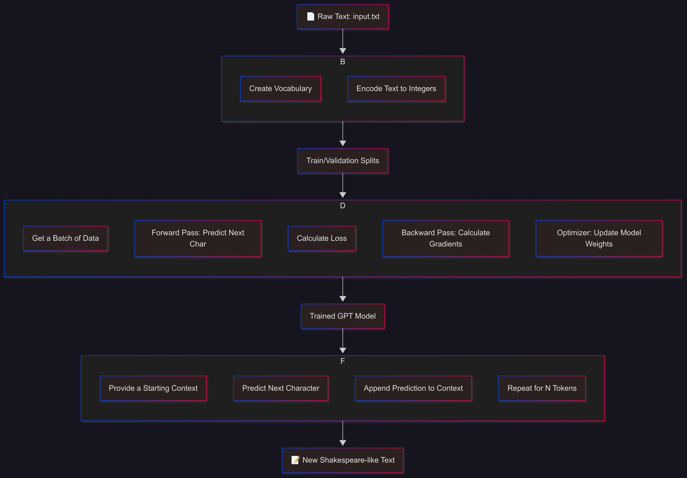

# GPT from Scratch — Karpathy YouTube Reimplementation

This repository is a step-by-step reimplementation of [Andrej Karpathy’s “Let’s Build GPT: from Scratch, in Code”](https://www.youtube.com/watch?v=kCc8FmEb1nY).  
The project builds a miniature GPT-style language model from the ground up in PyTorch, with all components clearly spelled out and explained.

---



## 📚 Features

- **Character-level tokenization**: Converts raw text into integer-encoded sequences.
- **Bigram Language Model**: A simple baseline before introducing transformers.
- **Transformer Blocks**:  
  - Embeddings  
  - Multi-head self-attention  
  - Layer normalization  
  - Stacked transformer layers
- **Training Loop**: Manual forward and backward passes, loss calculation, and optimization.
- **Text Generation**: Generate new, Shakespearean-style text with your trained model.

---

## 🚀 Why This Repo?

The goal is to make modern transformer architectures like GPT approachable for everyone. Every component is implemented from scratch—no black boxes—so you can see exactly how these models work under the hood.

---

## 🔗 Resources

- [Original YouTube Tutorial (Andrej Karpathy)](https://www.youtube.com/watch?v=kCc8FmEb1nY)
- [nanoGPT (Karpathy’s official minimal GPT repo)](https://github.com/karpathy/nanoGPT)
- [My Implementation (This Repo)](https://github.com/Fahad-sha/GPT-Shakespeare-Karpathy)

---

## 🛠️ Getting Started

```bash
git clone https://github.com/Fahad-sha/GPT-Shakespeare-Karpathy.git
cd GPT-Shakespeare-Karpathy
pip install -r requirements.txt
python train.py    # Or run the notebook for a step-by-step walkthrough
